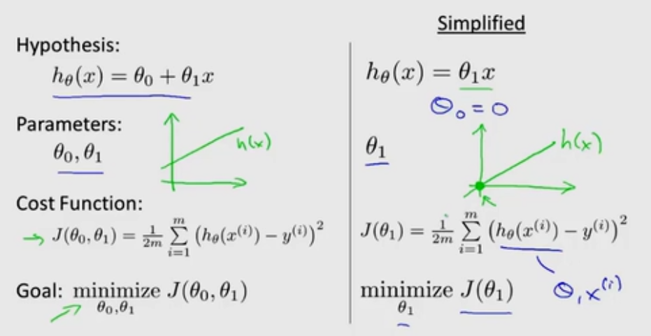
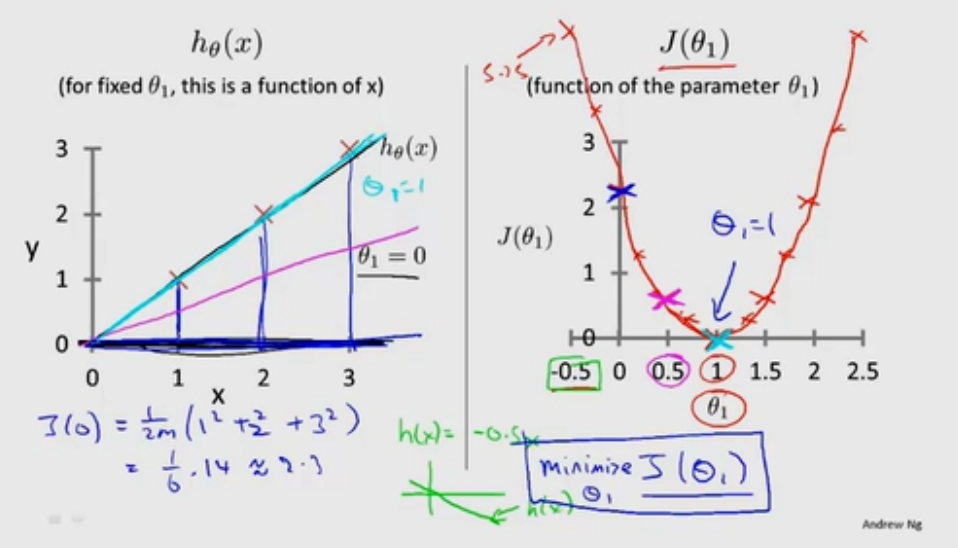
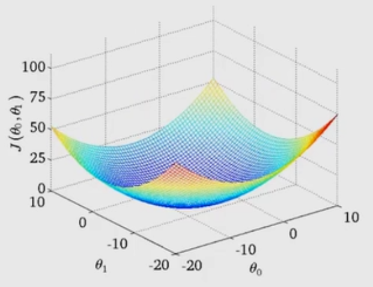
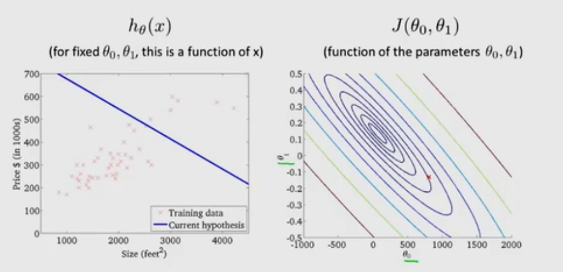
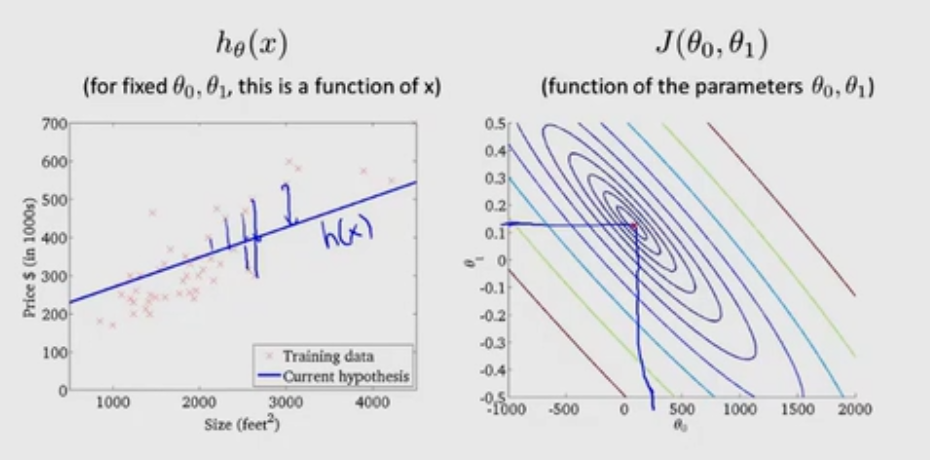

面对数据集，要得出θ_0和θ_1两个值使其更好地拟合数据，即

h_θ(x)=θ_0+θ_1*x

对于一个(x,y)使h_θ(x)更贴近y

实际上是一个最小值问题  
->使[h_θ(x)-y]²最小  
->使∑[h_θ(x_i)-y_i]²(i=1~m)最小  
->使∑/2m最小

# 代价函数(平方误差函数)

J(θ_0,θ_1)=∑{i=1~m}[h_θ(x_i)-y_i]²/2m

目标是使代价函数最小，即minmize{θ_0,θ_1}J(θ_0,θ_1)

# 小总结

- 假设函数  
h_θ(x)=θ_0+θ_1*x
- 参数  
θ_0和θ_1
- 代价函数  
J(θ_0,θ_1)=∑{i=1~m}[h_θ(x_i)-y_i]²/2m
- 目标  
minmize{θ_0,θ_1}J(θ_0,θ_1)

# 简化情况
令θ_0=0  

h_θ(x)=θ_1*x
J(θ_1)=∑{i=1~m}[h_θ(x_i)-y_i]²/2m

其中h函数为x的函数，J函数为θ_1的函数，形如

通过“试数”，计算出各个θ_1取值时J(θ_1)的取值，然后找出使J(θ_1)最小的θ_1取值

# 正常情况

其中h函数为x的函数，J函数为θ_0和θ_1的函数，形如

或用等高曲线来描述，在同一曲线上的函数值是相同的

最佳情况

# 引出的问题
如何找到最佳的θ_0和θ_1？