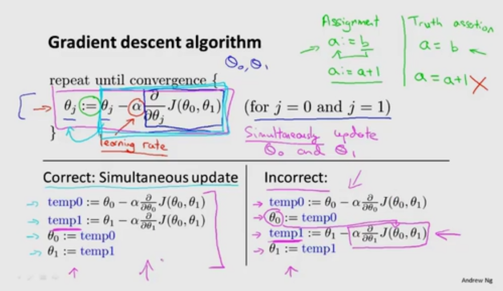

梯度下降算法用于最小化任意函数J

# 分析
- 已有
J(θ_0,θ_1)
- 目标
minmize{θ_0,θ_1}J(θ_0,θ_1)
- 思想
从一组θ_0和θ_1的初始值开始(一般为0,0)  
不断改变θ_0和θ_1，使J(θ_0,θ_1)最小

# 图示
从一个点开始“下山”，环顾360°，找出下山最快的方向，“迈出一步”，然后重复这一步，最终到达局部最低点

不同的起始点，会产生不同的局部最优解

# 梯度下降具体算法

θ_0和θ_1都要变化，具体做法大致为自减一个偏导数与学习速率α的乘积

学习速率α：用于控制梯度下降时的步子大小，更新θ_0和θ_1时的幅度

强调θ_0和θ_1同时变化(左下)，而非先后变化(右下)

# 单参数θ_1时对梯度下降算法的解释

## 导数项

导数为正时，左移  
导数为负时，右移  
符合预期

已经在最优点时，导数项为0，不移动

## 学习速率α

α较小时，可以多次一步步趋近到局部最小值，但下降速率很慢  
α较大时，可能跨过局部最小值，反复横跳

α不用改变就能趋近局部最小值，因为导数会逐渐变小

# 语法
- 赋值
a:=a+1  
a:=b
- 判断
a=b  
a=a+a必定为假
