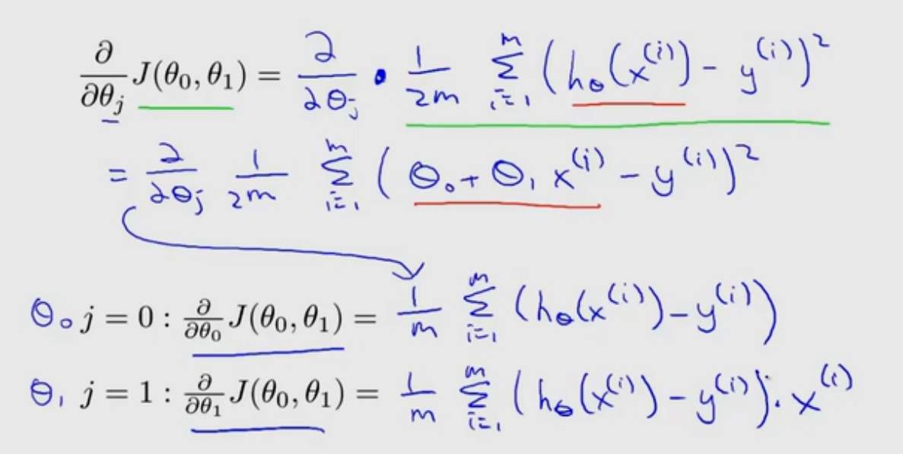

# 复习

前面分别学了梯度下降算法和线性回归算法，使用梯度下降算法来使代价函数最小化

# 化简

- 求出偏导

- 偏导代入梯度下降算法

# 局部最优解和全局最优解
其他的模型中，根据起点不同可能会存在多个局部最优解  
  
但是在线性回归模型中，代价函数总是呈弓形(凸函数)

梯度下降的路线如下

# Batch算法
指每次梯度下降总会遍历整个数据集的算法

# 未来
只遍历子集的算法  
直接计算出局部最优解的算法  
......