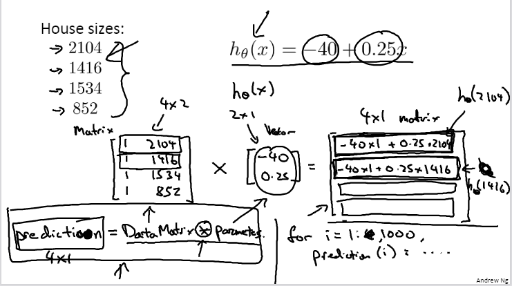
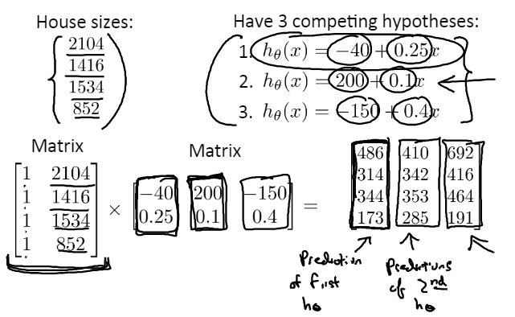

# 用矩阵乘法算结果

## 一个假设函数
对于四个房子面积，要用右侧假设函数计算预测结果

- 常规思路(右下)
用循环分别计算各个结果，写入结果数组

- 矩阵乘法思路(左下)
在数据中加一列1形成数据矩阵，然后乘-40和0.25组成的参数矩阵即可  
优点：代码量少、运算更快

## 多个假设函数
参数矩阵每列为一个假设函数即可

# 基础
矩阵乘法无交换律有结合律  
单位矩阵用I表示