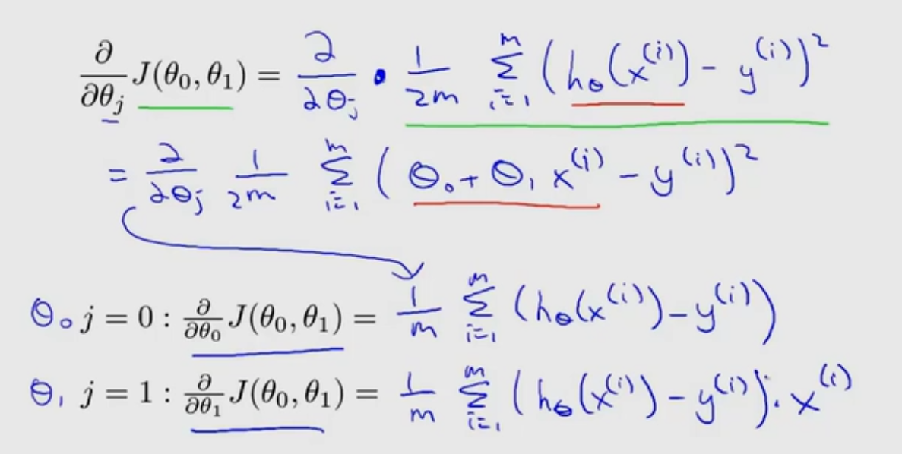

# 多元线性回归

## 复习
之前学的线性回归只有一个x  
假设函数只有两个θ

## 多元线性回归
多个x，多个θ，以向量形式表示，假设函数用向量內积的形式表示  
举例：房屋面积、卧室数量、楼层、使用年限

x的下标标注向量中的分量，上标标注样本号

多个x称为多个“特征”

# 多元梯度下降算法
类比线性回归中的梯度下降算法，求导之后的格式都没变
θ_0特殊，θ_1到θ_n格式相同

# 多元梯度下降算法的特征缩放

## 举例
房屋面积x_1取值0~2000  
卧室数量x_2取值1~5

产生的等高线图如P11，呈长条椭圆，导致梯度下降时间长，反复横跳，不理想

## 缩放
x_1:=x_1/2000  
x_2:=x_2/5  
等高线图呈圆形，梯度下降理想

## 特征值缩放
使特征值范围大致在-1到1之间  
-3到3，-1/3到1/3

使特征值减其平均值，再除其范围(最大最小值之差)

# 多元梯度下降算法的学习率
如何确定正确大小的学习率α？

绘制图像 P15
横轴为迭代次数，纵轴为代价函数的值

梯度下降错误运行的的图像P16  
原因是学习率太大，选择更小的即可

学习率太大，代价函数可能不会下降，不收敛，也可能缓慢收敛
学习率太小，缓慢收敛

选择学习率的大小：0.001,0.003,0.01,0.03,0.1,0.3,1.......(3倍)

# 特征选择和多项式回归

## 选择合适的特征
举例：房子的长宽作为两个特征不是很好用，相乘得到面积后用面积作为仅有的一个特征即可  

## 多项式拟合
P20
假设函数中的x_2,x_3的取值可以是x_1的平方、立方、根号  
达到用更复杂的多项式来拟合数据的目的  
注意：取幂之后，范围变大，更需要特征缩放

P21不用立方来防止右侧下降，转而用根号

未来可以有算法自动选择特征(自动选择怎样的多项式？)

# 正规方程求代价函数最小值

思想：求各θ的偏导，令偏导为0，解方程组求出各个θ的值

结论：不加证明的给出不用方程组转用线性代数矩阵运算的方法,公式见p28

## 梯度下降和正规方程的比较

### 梯度下降
1. 需要选择学习率
2. 需要进行多次迭代
3. 在特征数量n较大时仍有较好表现

### 正规方程
1. 不需要选择学习率
2. 不需要迭代
3. 需要计算矩阵的乘法和求逆运算，复杂度O(n^3)
4. 在n较大时很慢

其中，n在10的4次方以下时可考虑正规方程

## 矩阵是否可逆的问题
为什么不化简？给出的公式要求X的转置*X可逆，化简了要求X的转置可逆

X的转置*X一般是可逆的，因为其中的属性没有线性相关的

如果不可逆有两种情况
1. 选错了特征值  
选了平方公尺和平方米为单位的两个特征值，两者线性相关，凑出的矩阵不可逆  
解决：删除重复特征值
2. 特征值数量太多，样本数太小，m < n
解决：删除部分特征值，或用正则化方法(之后学)

即使不可逆，Octave的伪逆函数pinv()也能正确计算出结果  
还有求逆函数inv()，两者有一定区别
